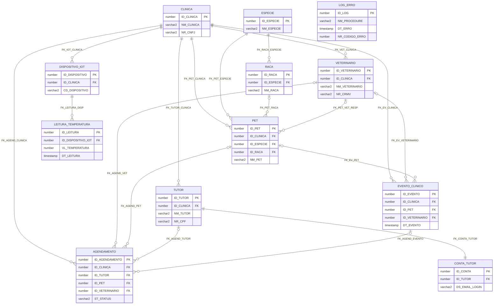

## Kura · Banco de Dados Oracle

KURA é um sistema de gestão de continuidade veterinária desenvolvido para a **Clyvo Vet** como parte do Challenge FIAP 2026. O banco Oracle 19c opera no padrão **Shared Database**, servindo simultaneamente dois backends independentes: o **Backend Clínica** (.NET, responsável pelo prontuário eletrônico, IoT e IA) e o **Backend Tutor** (Java, responsável por identidade, agendamentos e conformidade LGPD). Regras estritas de *ownership* de escrita por domínio evitam concorrência descontrolada, enquanto leitura cruzada entre serviços é permitida via views e entidades `@Immutable`. O schema foi projetado em 3ª Forma Normal (3FN), com constraints nomeadas, sequences Oracle e suporte nativo a `GenerationType.IDENTITY` do Hibernate 6.

---

## Sumário

- [Arquitetura](#arquitetura)
  - [Domínios e Propriedade das Tabelas](#domínios-e-propriedade-das-tabelas)
  - [Estratégia de Chave Primária](#estratégia-de-chave-primária)
- [Estrutura do Schema](#estrutura-do-schema)
  - [Tabelas (26)](#tabelas-26)
  - [Sequences (22)](#sequences-22)
  - [Índices](#índices)
  - [Views](#views)
- [PL/SQL — Requisitos Implementados](#plsql--requisitos-implementados)
  - [REQ 1 — Procedures de Carga Parametrizadas](#req-1--procedures-de-carga-parametrizadas)
  - [REQ 2 — Blocos Anônimos com JOINs](#req-2--blocos-anônimos-com-joins)
  - [REQ 3 — Relatório Analítico LAG / LEAD](#req-3--relatório-analítico-lag--lead)
  - [REQ 4 — Cursores Explícitos com IF / CASE](#req-4--cursores-explícitos-com-if--case)
- [Modelo de Tratamento de Erros](#modelo-de-tratamento-de-erros)
- [Pré-requisitos](#pré-requisitos)
- [Como Executar](#como-executar)
- [Re-execução e Limpeza](#re-execução-e-limpeza)
- [Diagrama Entidade-Relacionamento](#diagrama-entidade-relacionamento)
- [Variáveis de Ambiente / Conexão](#variáveis-de-ambiente--conexão)
- [Equipe](#equipe)
- [Licença](#licença)

---

## Arquitetura

### Domínios e Propriedade das Tabelas

| Domínio | Tabelas |
|---------|---------|
| **.NET (Backend Clínica)** | `CLINICA`, `VETERINARIO`, `TUTOR`, `PET`, `ESPECIE`, `RACA`, `EVENTO_CLINICO`, `TIPO_EVENTO`, `CONSULTA`, `VACINA`, `PRESCRICAO`, `MEDICAMENTO`, `EXAME`, `DOCUMENTO`, `NOTIFICACAO`, `DISPOSITIVO_IOT`, `LEITURA_TEMPERATURA`, `ALERTA_TEMPERATURA`, `TRIAGEM_LUNA`, `INVITE_TUTOR`, `TUTOR_PET` |
| **Java (Backend Tutor)** | `CONTA_TUTOR`, `CONSENTIMENTO`, `AGENDAMENTO`, `IDEMPOTENCY_KEY` |
| **Auditoria (Compartilhada)** | `LOG_ERRO` |

**Leitura cruzada:**
- .NET lê `CONTA_TUTOR`, `CONSENTIMENTO`, `AGENDAMENTO`
- Java lê `INVITE_TUTOR`, `TUTOR`, `PET`, `VETERINARIO`, `CLINICA`, `ESPECIE`, `RACA` via entidades `@Immutable`

A tabela `AGENDAMENTO` é **shared-write**: Java cria, edita e cancela; .NET atualiza `ST_STATUS` via PATCH. O campo `NR_VERSION` implementa Optimistic Locking (`@Version` do JPA/Hibernate) — conflito de versão resulta em `ORA-00001` tratado como HTTP 409.

### Estratégia de Chave Primária

O schema adota três estratégias de PK, diferenciadas por domínio:

| Estratégia | Tabelas | Motivo |
|-----------|---------|--------|
| `DEFAULT SEQ_xxx.NEXTVAL` | Todas as tabelas .NET (20 tabelas) | Sequências Oracle gerenciadas pelo EF Core; geração no lado do banco |
| `SEQ_AGENDAMENTO` compartilhada | `AGENDAMENTO` | Java usa `GenerationType.SEQUENCE` — necessita de sequence explícita; não usa `IDENTITY` para manter compatibilidade com SEQUENCE strategy |
| `GENERATED BY DEFAULT AS IDENTITY` | `CONTA_TUTOR`, `CONSENTIMENTO`, `IDEMPOTENCY_KEY` | Java usa `GenerationType.IDENTITY` com Hibernate 6 — Oracle 19c suporta nativamente; sem sequence Oracle visível |

---

## Estrutura do Schema

### Tabelas (26)

| Tabela | PK | Domínio | Descrição resumida |
|--------|----|---------|---------------------|
| `CLINICA` | `ID_CLINICA` (SEQ) | .NET | Clínicas veterinárias cadastradas. Java lê via `@Immutable`. |
| `ESPECIE` | `ID_ESPECIE` (SEQ) | .NET | Lookup de espécies animais (Cão, Gato, Ave…). Cacheable. |
| `MEDICAMENTO` | `ID_MEDICAMENTO` (SEQ) | .NET | Catálogo central de medicamentos para prescrições. |
| `TIPO_EVENTO` | `ID_TIPO_EVENTO` (SEQ) | .NET | Lookup de tipos de evento: CONSULTA, VACINA, EXAME, PROCEDIMENTO etc. |
| `VETERINARIO` | `ID_VETERINARIO` (SEQ) | .NET | Veterinários da clínica. FK para `CLINICA`. Java lê via `@Immutable`. |
| `TUTOR` | `ID_TUTOR` (SEQ) | .NET | Responsável pelo pet. Conta de acesso = `CONTA_TUTOR` (Java). |
| `RACA` | `ID_RACA` (SEQ) | .NET | Raças por espécie. UK composto `(NM_RACA, ID_ESPECIE)`. Cacheable. |
| `PET` | `ID_PET` (SEQ) | .NET | Animal atendido. `ID_PET` = prontuário único do paciente. |
| `TUTOR_PET` | `(ID_TUTOR, ID_PET)` | .NET | Vínculo N:N tutores ↔ pets. Suporta guarda compartilhada. |
| `EVENTO_CLINICO` | `ID_EVENTO` (SEQ) | .NET | Núcleo da timeline clínica. Cada interação = 1 evento. |
| `CONSULTA` | `ID_CONSULTA` (SEQ) | .NET | Detalhes clínicos de consulta. Relação 1:1 com `EVENTO_CLINICO`. |
| `VACINA` | `ID_VACINA` (SEQ) | .NET | Dados de vacinação. `DT_PROXIMA_DOSE` alimenta lembretes da Luna. |
| `PRESCRICAO` | `ID_PRESCRICAO` (SEQ) | .NET | Prescrições de medicamentos vinculadas a evento clínico. |
| `EXAME` | `ID_EXAME` (SEQ) | .NET | Exames realizados com resultado textual vinculados a evento. |
| `DOCUMENTO` | `ID_DOCUMENTO` (SEQ) | .NET | Ponteiros para arquivos em blob storage (Azure Blob / S3). |
| `NOTIFICACAO` | `ID_NOTIFICACAO` (SEQ) | .NET | Notificações in-app e lembretes para tutores e veterinários. |
| `DISPOSITIVO_IOT` | `ID_DISPOSITIVO` (SEQ) | .NET | Sensores IoT (ESP32). Autenticação via `X-Api-Key` no .NET. |
| `LEITURA_TEMPERATURA` | `ID_LEITURA` (SEQ) | .NET | Time-series de temperatura e umidade (~1.440 leituras/dia/sensor). |
| `ALERTA_TEMPERATURA` | `ID_ALERTA` (SEQ) | .NET | Alertas por leitura fora da faixa. Um alerta por evento de temperatura. |
| `TRIAGEM_LUNA` | `ID_TRIAGEM` (SEQ) | .NET | Triagens realizadas pela IA Luna. Tutor/Pet opcionais (sem cadastro). |
| `INVITE_TUTOR` | `ID_INVITE` (SEQ) | .NET | UUID de onboarding gerado pelo .NET, consumido 1x pelo Java. |
| `CONTA_TUTOR` | `ID_CONTA` (IDENTITY) | Java | Credenciais de acesso ao portal do tutor. Exclusivo do Backend Java. |
| `CONSENTIMENTO` | `ID_CONSENTIMENTO` (IDENTITY) | Java | Histórico LGPD art. 7º, I. Somente INSERT — nunca UPDATE. |
| `AGENDAMENTO` | `ID_AGENDAMENTO` (SEQ) | Java / Shared | Shared-write. Java cria/edita/cancela; .NET atualiza `ST_STATUS`. |
| `IDEMPOTENCY_KEY` | `ID_IDEMPOTENCY` (IDENTITY) | Java | Garantia exactly-once para POSTs sensíveis. TTL 24h. |
| `LOG_ERRO` | `ID_LOG` (SEQ) | Auditoria | Log de erros de procedures Oracle. Sem FKs intencionalmente. |

### Sequences (22)

Todas as sequences são criadas com `START WITH 1 INCREMENT BY 1 NOCACHE NOCYCLE`.

| Sequence | Tabela proprietária |
|----------|---------------------|
| `SEQ_CLINICA` | `CLINICA` |
| `SEQ_VETERINARIO` | `VETERINARIO` |
| `SEQ_TUTOR` | `TUTOR` |
| `SEQ_ESPECIE` | `ESPECIE` |
| `SEQ_RACA` | `RACA` |
| `SEQ_PET` | `PET` |
| `SEQ_TIPO_EVENTO` | `TIPO_EVENTO` |
| `SEQ_EVENTO_CLINICO` | `EVENTO_CLINICO` |
| `SEQ_CONSULTA` | `CONSULTA` |
| `SEQ_VACINA` | `VACINA` |
| `SEQ_MEDICAMENTO` | `MEDICAMENTO` |
| `SEQ_PRESCRICAO` | `PRESCRICAO` |
| `SEQ_EXAME` | `EXAME` |
| `SEQ_DOCUMENTO` | `DOCUMENTO` |
| `SEQ_AGENDAMENTO` | `AGENDAMENTO` (Java `GenerationType.SEQUENCE`) |
| `SEQ_NOTIFICACAO` | `NOTIFICACAO` |
| `SEQ_LOG_ERRO` | `LOG_ERRO` |
| `SEQ_DISPOSITIVO_IOT` | `DISPOSITIVO_IOT` |
| `SEQ_LEITURA_TEMP` | `LEITURA_TEMPERATURA` |
| `SEQ_ALERTA_TEMP` | `ALERTA_TEMPERATURA` |
| `SEQ_TRIAGEM_LUNA` | `TRIAGEM_LUNA` |
| `SEQ_INVITE_TUTOR` | `INVITE_TUTOR` |

> As tabelas Java com `GENERATED BY DEFAULT AS IDENTITY` (`CONTA_TUTOR`, `CONSENTIMENTO`, `IDEMPOTENCY_KEY`) não possuem sequence Oracle explícita.

### Índices

**Índices de FK (performance de JOIN)**

| Índice | Tabela | Colunas |
|--------|--------|---------|
| `IDX_VET_CLINICA` | `VETERINARIO` | `ID_CLINICA` |
| `IDX_TUTOR_CLINICA` | `TUTOR` | `ID_CLINICA` |
| `IDX_RACA_ESPECIE` | `RACA` | `ID_ESPECIE` |
| `IDX_PET_CLINICA` | `PET` | `ID_CLINICA` |
| `IDX_PET_ESPECIE` | `PET` | `ID_ESPECIE` |
| `IDX_PET_RACA` | `PET` | `ID_RACA` |
| `IDX_PET_VET_RESP` | `PET` | `ID_VETERINARIO_RESP` |
| `IDX_TP_PET` | `TUTOR_PET` | `ID_PET` |
| `IDX_EV_CLINICA` | `EVENTO_CLINICO` | `ID_CLINICA` |
| `IDX_EV_PET` | `EVENTO_CLINICO` | `ID_PET` |
| `IDX_EV_VETERINARIO` | `EVENTO_CLINICO` | `ID_VETERINARIO` |
| `IDX_EV_TIPO` | `EVENTO_CLINICO` | `ID_TIPO_EVENTO` |
| `IDX_DOC_EVENTO` | `DOCUMENTO` | `ID_EVENTO_CLINICO` |
| `IDX_NOTIF_CLINICA` | `NOTIFICACAO` | `ID_CLINICA` |
| `IDX_NOTIF_TUTOR` | `NOTIFICACAO` | `ID_TUTOR` |
| `IDX_IOT_CLINICA` | `DISPOSITIVO_IOT` | `ID_CLINICA` |
| `IDX_ALERTA_LEITURA` | `ALERTA_TEMPERATURA` | `ID_LEITURA_TEMPERATURA` |
| `IDX_TRIAGEM_CLINICA` | `TRIAGEM_LUNA` | `ID_CLINICA` |
| `IDX_TRIAGEM_PET` | `TRIAGEM_LUNA` | `ID_PET` |
| `IDX_CONS_TUTOR` | `CONSENTIMENTO` | `(ID_TUTOR, DS_TIPO)` |
| `IDX_AGEND_CLINICA` | `AGENDAMENTO` | `ID_CLINICA` |
| `IDX_AGEND_TUTOR` | `AGENDAMENTO` | `ID_TUTOR` |
| `IDX_AGEND_PET` | `AGENDAMENTO` | `ID_PET` |
| `IDX_INVITE_TUTOR` | `INVITE_TUTOR` | `ID_TUTOR` |

**Índices compostos**

| Índice | Tabela | Colunas | Propósito |
|--------|--------|---------|-----------|
| `IDX_INVITE_TOKEN_ATIVO` | `INVITE_TUTOR` | `(NR_TOKEN, ST_UTILIZADO, ST_ATIVO)` | Filtro de `InviteTutorRepository.findByNrToken()` — WHERE token + não utilizado + ativo |
| `IDX_ALERTA_ATIVOS` | `ALERTA_TEMPERATURA` | `(ST_RESOLVIDO, DT_CRIACAO DESC)` | Dashboard de alertas não resolvidos, por recência |

**Índices de suporte a queries analíticas e TTL**

| Índice | Tabela | Colunas | Propósito |
|--------|--------|---------|-----------|
| `IDX_EV_DATA` | `EVENTO_CLINICO` | `DT_EVENTO DESC` | Timeline cronológica reversa |
| `IDX_LEITURA_DISP_DATA` | `LEITURA_TEMPERATURA` | `(ID_DISPOSITIVO_IOT, DT_LEITURA DESC)` | Time-series por sensor, partição temporal |
| `IDX_AGEND_DATA` | `AGENDAMENTO` | `DT_AGENDAMENTO` | Busca por janela de datas |
| `IDX_AGEND_STATUS` | `AGENDAMENTO` | `ST_STATUS` | Filtro de status (pendentes, realizados…) |
| `IDX_AGEND_EVENTO` | `AGENDAMENTO` | `ID_EVENTO_GERADO` | JOIN inverso AGENDAMENTO → EVENTO_CLINICO |
| `IDX_LOG_DATA` | `LOG_ERRO` | `DT_ERRO DESC` | Auditoria temporal reversa |
| `IDX_LOG_PROCEDURE` | `LOG_ERRO` | `NM_PROCEDURE` | Filtro por procedure com erro |
| `IDX_IDEMPOT_EXPIRA` | `IDEMPOTENCY_KEY` | `DT_EXPIRACAO` | Job de limpeza TTL: `DELETE WHERE DT_EXPIRACAO < SYSDATE` |
| `IDX_IDEMPOT_CRIACAO` | `IDEMPOTENCY_KEY` | `DT_CRIACAO` | Limpeza alternativa por data de criação (Flyway V2) |

### Views

| View | Tabelas-fonte | Propósito | Consumidor |
|------|--------------|-----------|------------|
| `VW_TIMELINE_PET` | `AGENDAMENTO`, `PET`, `CLINICA` | Linha do tempo de atendimentos por pet, com aliases V6 (`ID_EVENTO`, `DT_EVENTO`). Filtra `ID_PET IS NOT NULL`. | Java `TimelineService` |
| `VW_VACINAS_VENCENDO` | `AGENDAMENTO`, `PET`, `CLINICA` | Vacinas agendadas (tipo `'VACINA'`) nos próximos 30 dias, não canceladas nem realizadas. `INTERVAL '30' DAY`. | Luna (alertas preventivos) |
| `VW_TIMELINE_CLINICA` | `PET`, `EVENTO_CLINICO`, `VETERINARIO`, `TIPO_EVENTO`, `CLINICA` | Timeline clínica completa via `EVENTO_CLINICO` do .NET — separada da `VW_TIMELINE_PET`. Filtra `ST_ATIVO = 'S'`. | .NET e Luna |

---

## PL/SQL — Requisitos Implementados

Todo o PL/SQL está consolidado no arquivo `src/kura_schema_final_entrega.sql`, nas Seções 2 a 5.

### REQ 1 — Procedures de Carga Parametrizadas

Cinco stored procedures que inserem dados nas tabelas base sem nenhum valor hard-coded. Todos os parâmetros são tipados com `%TYPE`. Um bloco anônimo de demonstração ao final da seção invoca todas as procedures em sequência (ordem FK-safe: CLINICA → ESPECIE → VETERINARIO → TUTOR → PET), populando dados para os REQs 2, 3 e 4.

**Regras atendidas:**
- [x] `[R1.1]` Carga exclusivamente via parâmetro — SEM hard-code
- [x] `[R1.2]` `EXCEPTION WHEN OTHERS` em todos os blocos
- [x] `[R1.3]` Mínimo de 2 exceções específicas por procedure (`DUP_VAL_ON_INDEX`, `VALUE_ERROR`, `NO_DATA_FOUND`)
- [x] `[R1.4]` Log gravado em `LOG_ERRO` com: `NM_PROCEDURE`, `USER`, `SYSTIMESTAMP`, `SQLCODE`, `SQLERRM`, `DS_PARAMETROS`

**Procedures implementadas:**

| Procedure | Tabela-alvo | Parâmetros principais | Exceções específicas |
|-----------|-------------|-----------------------|----------------------|
| `PRC_INSERT_CLINICA` | `CLINICA` | `p_nm_clinica`, `p_nr_cnpj`, `p_nm_razao_social`, `p_ds_endereco`, `p_nm_cidade`, `p_sg_uf`, `p_nr_cep`, `p_ds_telefone`, `p_ds_email`, `p_ds_email_acesso`, `p_ds_senha_hash` | `DUP_VAL_ON_INDEX` (CNPJ ou e-mail duplicado), `VALUE_ERROR` (tamanho/tipo inválido) |
| `PRC_INSERT_ESPECIE` | `ESPECIE` | `p_nm_especie` | `DUP_VAL_ON_INDEX` (nome duplicado), `VALUE_ERROR` |
| `PRC_INSERT_VETERINARIO` | `VETERINARIO` | `p_id_clinica`, `p_nm_veterinario`, `p_nr_crmv`, `p_ds_email`, `p_nr_telefone` | `DUP_VAL_ON_INDEX` (CRMV ou e-mail), `NO_DATA_FOUND` (clínica inexistente ou inativa) |
| `PRC_INSERT_TUTOR` | `TUTOR` | `p_id_clinica`, `p_nm_tutor`, `p_nr_cpf`, `p_ds_email`, `p_ds_telefone`, `p_ds_whatsapp`, `p_nm_cidade`, `p_sg_uf` | `DUP_VAL_ON_INDEX` (CPF ou e-mail), `VALUE_ERROR` |
| `PRC_INSERT_PET` | `PET` | `p_id_clinica`, `p_id_especie`, `p_id_raca`, `p_nm_pet`, `p_dt_nascim`, `p_sg_sexo`, `p_sg_porte` | `NO_DATA_FOUND` (espécie inexistente), `VALUE_ERROR` (sexo fora de `M/F` ou porte fora de `P/M/G`) |

> `PRC_INSERT_VETERINARIO` e `PRC_INSERT_PET` executam um `SELECT INTO` de validação FK **antes** do `INSERT`, disparando `NO_DATA_FOUND` com mensagem contextualizada caso a entidade pai não exista ou esteja inativa.

---

### REQ 2 — Blocos Anônimos com JOINs

Dois blocos anônimos PL/SQL com cursor explícito, cada um unindo 3 tabelas, com `GROUP BY` e `ORDER BY`, produzindo relatórios formatados via `DBMS_OUTPUT`.

**Regras atendidas:**
- [x] `[R2.1]` 2 blocos anônimos PL/SQL com cursor explícito
- [x] `[R2.2]` Cada bloco com JOIN entre ≥ 3 tabelas distintas
- [x] `[R2.3]` `GROUP BY` aplicado
- [x] `[R2.4]` `ORDER BY` aplicado
- [x] `[R2.5]` Saída formatada via `DBMS_OUTPUT` (cabeçalho + dados + totais)

**Bloco A — Distribuição de Pets por Espécie e Clínica**

- Tabelas unidas: `PET` ⟶ `ESPECIE` ⟶ `CLINICA` (2 JOINs / 3 tabelas)
- `GROUP BY`: `c.NM_CLINICA, e.NM_ESPECIE`
- `ORDER BY`: `c.NM_CLINICA ASC, QT_PETS DESC`
- Métricas: total de pets ativos, breakdown por sexo (machos/fêmeas) e porte (P/M/G)
- Saída: separador por clínica + **Total Geral** de pets ativos ao fim

**Bloco B — Resumo de Agendamentos por Status e Veterinário**

- Tabelas unidas: `AGENDAMENTO` ⟶ `VETERINARIO` ⟶ `CLINICA` (2 JOINs / 3 tabelas)
- Filtro: `DT_AGENDAMENTO >= ADD_MONTHS(SYSTIMESTAMP, -12)` (últimos 12 meses)
- `GROUP BY`: `c.NM_CLINICA, v.NM_VETERINARIO, a.ST_STATUS`
- `ORDER BY`: `c.NM_CLINICA, v.NM_VETERINARIO, QT_AGEND DESC`
- `CASE` para rótulo de status: ex. `'NAO_COMPARECEU'` → `'** Nao Compareceu'`
- Saída: **Sub-Total por veterinário** + `TOTAL GERAL` de agendamentos ao fim

---

### REQ 3 — Relatório Analítico LAG / LEAD

Bloco analítico sobre a tabela `LEITURA_TEMPERATURA` (time-series dos sensores IoT). Um bloco de carga de demonstração é executado **antes** do bloco analítico, inserindo 1 dispositivo (`ESP32-KURA-01`) e 7 leituras espaçadas em 1 minuto — garantindo que as posições 2 a 6 (5 linhas) tenham `LAG` e `LEAD` não nulos.

**Regras atendidas:**
- [x] `[R3.1]` `LAG()` com resultado impresso
- [x] `[R3.2]` `LEAD()` com resultado impresso
- [x] `[R3.3]` `PARTITION BY ID_DISPOSITIVO_IOT` — suporte a múltiplos sensores
- [x] `[R3.4]` `ORDER BY DT_LEITURA` — série temporal correta
- [x] `[R3.5]` `NULL` tratado e exibido como `'Vazio'` (primeira e última linha da série)
- [x] `[R3.6]` ≥ 5 linhas com valor anterior **e** próximo não nulos (posições 2–6 de 7)
- [x] `[R3.7]` Dados de demonstração inseridos imediatamente antes do bloco analítico

**Função de janela implementada:**

```sql
-- LAG: temperatura da leitura anterior (NULL se primeira linha da partição)
LAG(lt.VL_TEMPERATURA, 1, NULL)
    OVER (PARTITION BY lt.ID_DISPOSITIVO_IOT
          ORDER BY lt.DT_LEITURA)  AS VL_ANTERIOR,

-- LEAD: temperatura da próxima leitura (NULL se última linha da partição)
LEAD(lt.VL_TEMPERATURA, 1, NULL)
    OVER (PARTITION BY lt.ID_DISPOSITIVO_IOT
          ORDER BY lt.DT_LEITURA)  AS VL_PROXIMO
```

O cursor também une `LEITURA_TEMPERATURA` com `DISPOSITIVO_IOT` (JOIN) para exibir o código do sensor (`CD_DISPOSITIVO`). Um `CASE` adicional classifica a temperatura atual em `Normal` / `! Atencao` (≥25°C) / `*** ALTA ***` (≥27°C).

---

### REQ 4 — Cursores Explícitos com IF / CASE

Quatro blocos anônimos, cada um com o padrão completo `OPEN / FETCH / EXIT WHEN %NOTFOUND / CLOSE` e estruturas de tomada de decisão.

**Regras atendidas:**
- [x] `[R4.1]` 4 blocos anônimos com cursor explícito
- [x] `[R4.2]` Padrão completo: `OPEN / FETCH / EXIT WHEN %NOTFOUND / CLOSE`
- [x] `[R4.3]` Estrutura `IF` usada em pelo menos um bloco (Blocos I, II e IV)
- [x] `[R4.4]` Estrutura `CASE` usada em pelo menos um bloco (Blocos II e III)
- [x] `[R4.5]` **OBRIGATÓRIO:** Sub-Total por grupo + Total Geral (Bloco I)
- [x] `[R4.6]` Saída formatada via `DBMS_OUTPUT` com cabeçalhos e separadores

| Bloco | Tabelas | Decisão | Destaque |
|-------|---------|---------|----------|
| **I** | `CLINICA` + `VETERINARIO` | `IF` em cascata — classifica porte da clínica pelo total de vets (≥5→Grande; ≥3→Médio; else→Pequeno) | **Sub-Total por clínica** (Ativos, Inativos, Total, Porte) + **Total Geral** *(rubrica obrigatória)* |
| **II** | `PET` + `ESPECIE` + `CLINICA` | `CASE` no porte (`P/M/G` → rótulo); `IF` cascata na fase de vida (`<6m`→Filhote; `<18m`→Jovem; `<84m`→Adulto; else→Sênior) | `MONTHS_BETWEEN(SYSDATE, DT_NASCIMENTO)` calcula idade. Prioridade preventiva por fase (Filhote/Sênior = ALTA) |
| **III** | `AGENDAMENTO` + `CLINICA` + `VETERINARIO` (LEFT JOIN) | `CASE` em `ST_STATUS` + `HORAS_DIFF` → ação recomendada (ex. `AGENDADO` + atraso >2h → `*** CONFIRMAR URGENTE ***`) | Contagem de pendentes totais e casos críticos ao fim |
| **IV** | `LEITURA_TEMPERATURA` + `DISPOSITIVO_IOT` | `IF` em cascata: `≥27°C`→`*** CRITICA ***`; `≥24°C`→`! Alta`; `≥15°C`→`Normal`; else→`* Baixa` | Resumo por faixa (Normal / Alta / Crítica / Baixa) + Total ao fim |

---

## Modelo de Tratamento de Erros

Todas as cinco procedures do REQ 1 implementam um padrão uniforme de captura e log de erros baseado na tabela `LOG_ERRO`.

**Estrutura da tabela `LOG_ERRO`** (derivada do DDL):

| Coluna | Tipo | Descrição |
|--------|------|-----------|
| `ID_LOG` | `NUMBER(15)` | PK gerada por `SEQ_LOG_ERRO.NEXTVAL` |
| `NM_PROCEDURE` | `VARCHAR2(120)` | Nome da procedure que gerou o erro (constante `c_proc`) |
| `NM_USUARIO` | `VARCHAR2(60)` | `USER` Oracle no momento do erro |
| `DT_ERRO` | `TIMESTAMP` | `SYSTIMESTAMP` no momento do erro |
| `NR_CODIGO_ERRO` | `NUMBER(10)` | `SQLCODE` (negativo em erros Oracle) |
| `DS_MENSAGEM_ERRO` | `VARCHAR2(2000)` | Prefixo legível + `SQLERRM` |
| `DS_PARAMETROS` | `VARCHAR2(2000)` | Parâmetros da chamada que causou o erro |
| `DS_STACK_TRACE` | `CLOB` | Stack trace completo (opcional — disponível via `DBMS_UTILITY`) |

> `LOG_ERRO` é criada **sem FKs intencionalmente**: um registro de auditoria jamais deve falhar por violação referencial.

**As três camadas de exceção implementadas em cada procedure:**

1. **Exceção nomeada específica 1** — `DUP_VAL_ON_INDEX` (violação de `UNIQUE`) **ou** `NO_DATA_FOUND` (FK pai inexistente/inativa)
2. **Exceção nomeada específica 2** — `VALUE_ERROR` (dado com tipo ou tamanho incompatível com o campo destino)
3. **Fallback** — `WHEN OTHERS` captura qualquer exceção não tratada pelas camadas anteriores

**Padrão do bloco `EXCEPTION` (copiado de `PRC_INSERT_CLINICA`):**

```sql
EXCEPTION
    -- Exceção específica 1: violação de UNIQUE (CNPJ ou e-mail duplicado)
    WHEN DUP_VAL_ON_INDEX THEN
        ROLLBACK;
        INSERT INTO LOG_ERRO (ID_LOG, NM_PROCEDURE, NM_USUARIO, DT_ERRO,
                              NR_CODIGO_ERRO, DS_MENSAGEM_ERRO, DS_PARAMETROS)
        VALUES (SEQ_LOG_ERRO.NEXTVAL, c_proc, USER, SYSTIMESTAMP,
                SQLCODE, 'DUP_VAL_ON_INDEX: CNPJ ou e-mail ja cadastrado. ' || SQLERRM,
                'NM_CLINICA=' || p_nm_clinica || ' | NR_CNPJ=' || p_nr_cnpj);
        COMMIT;
        DBMS_OUTPUT.PUT_LINE('[ERRO] Clinica duplicada — log gravado.');
    -- Exceção específica 2: valor fora do tamanho do campo
    WHEN VALUE_ERROR THEN
        ROLLBACK;
        INSERT INTO LOG_ERRO (ID_LOG, NM_PROCEDURE, NM_USUARIO, DT_ERRO,
                              NR_CODIGO_ERRO, DS_MENSAGEM_ERRO, DS_PARAMETROS)
        VALUES (SEQ_LOG_ERRO.NEXTVAL, c_proc, USER, SYSTIMESTAMP,
                SQLCODE, 'VALUE_ERROR: Campo com tamanho/tipo invalido. ' || SQLERRM,
                'NM_CLINICA=' || p_nm_clinica);
        COMMIT;
        DBMS_OUTPUT.PUT_LINE('[ERRO] Valor invalido — log gravado.');
    WHEN OTHERS THEN
        ROLLBACK;
        INSERT INTO LOG_ERRO (ID_LOG, NM_PROCEDURE, NM_USUARIO, DT_ERRO,
                              NR_CODIGO_ERRO, DS_MENSAGEM_ERRO, DS_PARAMETROS)
        VALUES (SEQ_LOG_ERRO.NEXTVAL, c_proc, USER, SYSTIMESTAMP,
                SQLCODE, 'OTHERS: ' || SQLERRM,
                'NM_CLINICA=' || p_nm_clinica || ' | NR_CNPJ=' || p_nr_cnpj);
        COMMIT;
        DBMS_OUTPUT.PUT_LINE('[ERRO] Erro inesperado — log gravado.');
END PRC_INSERT_CLINICA;
```

Em todos os handlers: o `INSERT` no `LOG_ERRO` é seguido de `COMMIT` autônomo, garantindo que o registro de auditoria seja persistido mesmo após o `ROLLBACK` da transação principal.

---

## Pré-requisitos

| Requisito | Versão mínima | Observação |
|-----------|--------------|------------|
| Oracle Database | 19c | `GENERATED BY DEFAULT AS IDENTITY` requer 12c+; `INTERVAL` literals requer 9i+ |
| Oracle SQL Developer | 21.x+ | Para visualização de `DBMS_OUTPUT` |
| Usuário Oracle | Qualquer | Necessita `CREATE TABLE`, `CREATE SEQUENCE`, `CREATE PROCEDURE`, `CREATE VIEW` |

---

## Como Executar

O arquivo `src/kura_schema_final_entrega.sql` é o único arquivo de entrega. Ele contém o DDL completo (Seção 1) e todos os blocos PL/SQL REQ 1–4 (Seções 2–5) em ordem de execução correta.

```
1. Clone o repositório
2. Abra o Oracle SQL Developer (ou SQLcl)
3. Conecte ao schema de destino
4. Execute: SET SERVEROUTPUT ON SIZE UNLIMITED;
5. Execute o arquivo completo: src/kura_schema_final_entrega.sql
6. Verifique a saída do DBMS_OUTPUT para confirmação de cada seção
```

A saída esperada inclui mensagens `[OK]` de cada procedure de carga e os relatórios formatados dos quatro REQs (Relatórios A, B, C, I, II, III e IV).

> ⚠️ **Atenção:** Para re-execução em ambiente existente, descomente o bloco `DROP` na Seção 0 do arquivo antes de executar. A ordem de `DROP` respeita as dependências de FK em cascata (tabelas filhas antes das tabelas pai).

---

## Re-execução e Limpeza

O arquivo contém um bloco `DROP` comentado na **Seção 0** (linhas 89–140). Ele está comentado por padrão para evitar destruição acidental do schema em primeira execução.

**Por que está comentado:**
- Na primeira execução, as tabelas ainda não existem — descomentado causaria erros `ORA-00942`.
- Em ambientes de avaliação, a intenção é executar apenas uma vez sobre um schema limpo.

**Ordem de DROP (FK-safe — tabelas filhas antes das pai):**

```sql
-- DROP TABLE IDEMPOTENCY_KEY              CASCADE CONSTRAINTS;
-- DROP TABLE CONSENTIMENTO                CASCADE CONSTRAINTS;
-- DROP TABLE CONTA_TUTOR                  CASCADE CONSTRAINTS;
-- DROP TABLE AGENDAMENTO                  CASCADE CONSTRAINTS;
-- DROP TABLE TRIAGEM_LUNA                 CASCADE CONSTRAINTS;
-- DROP TABLE ALERTA_TEMPERATURA           CASCADE CONSTRAINTS;
-- DROP TABLE LEITURA_TEMPERATURA          CASCADE CONSTRAINTS;
-- ... (continua até CLINICA e LOG_ERRO)
-- DROP SEQUENCE SEQ_CLINICA;
-- ... (22 sequences)
-- DROP VIEW VW_TIMELINE_PET;
-- DROP VIEW VW_VACINAS_VENCENDO;
```

**Para re-executar do zero via SQLcl:**

```bash
# Edite o arquivo e descomente o bloco DROP (Seção 0, linhas 89-140)
# Depois execute:
sql <user>/<password>@<host>:1521/<service> @src/kura_schema_final_entrega.sql
```

---

## Diagrama Entidade-Relacionamento

Entidades centrais do domínio (10 de 26 tabelas):



---

## Variáveis de Ambiente / Conexão

Este repositório não contém código de aplicação — as strings de conexão residem nos repositórios dos backends .NET e Java. Para referência, o template de variáveis de ambiente esperado pelos backends é:

```env
DB_HOST=<oracle-host>
DB_PORT=1521
DB_SERVICE=<service-name>
DB_USER=<schema-owner>
DB_PASSWORD=<password>
```

A infraestrutura Oracle é provida pela FIAP (parceria FIAP × Oracle — instância sempre ativa). Não é necessário container Docker local para o Oracle em avaliação.

---

## Equipe

| Nome | RM | Responsabilidade |
|------|----|-----------------|
| Felipe Ferrete  | RM562999 | Tech lead · .NET · IoT · IA |
| Clayton Alves   | RM562285 | DevOps · BD |
| Nikolas Brisola | RM564371 | Java · Backend Tutor |
| Guilherme Sola  | RM563674 | Mobile Tutor · UX |
| Gustavo Bosak   | RM566315 | Mobile Clínica · QA |
---

## Licença

> Projeto acadêmico — FIAP Challenge 2026. Todos os direitos reservados à equipe e à Clyvo Vet.
